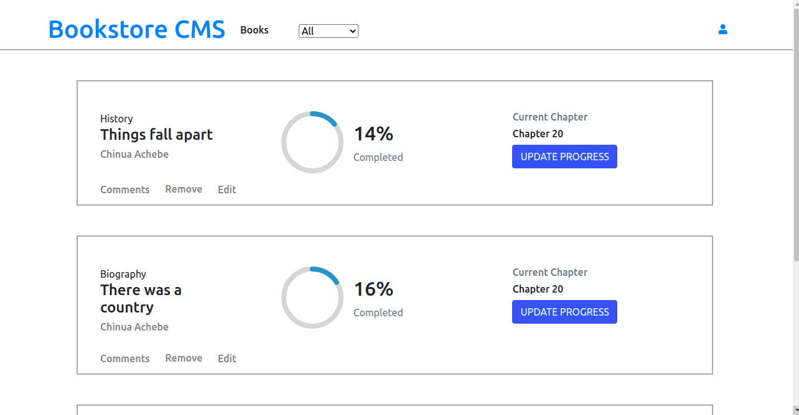

# Mathemagician

> This is an app that helps organize and manage a bookstore of a fiction company



## Built With

- Javascript
- React
- CSS
- Bootstrap
- Redux

## Live Demo

[Live Demo](https://react-js-bookstore.netlify.app/)

## Getting Started

To get a local copy up and running follow these simple example steps.

# Instructions (Set Up)

Clone this repository in your computer

```
$ git clone git@github.com:Kingobaino1/react-bookstore-app.git
```

To install dependencies, run the code below in terminal

```
$ npm install
```

To see it locally run

```
$ npm start
```

Then open localhost:3000 in your web browser.


## Author

👤 **Kingsley Ibeh**

- GitHub: [@githubhandle](https://github.com/Kingobaino1)
- Twitter: [@twitterhandle](https://twitter.com/ibehkingso)
- Linkedin: [@linkedinhandle](https://www.linkedin.com/in/kingsley-ibeh/)

## 🤝 Contributing

Contributions, issues and feature requests are welcome!
Feel free to check the issues page.

## Show your support

Give a ⭐️ if you like this project!

## Acknowledgments

- [Microverse](https://www.microverse.org/).

## 📝 License

This project is [MIT licensed](/LICENSE).
